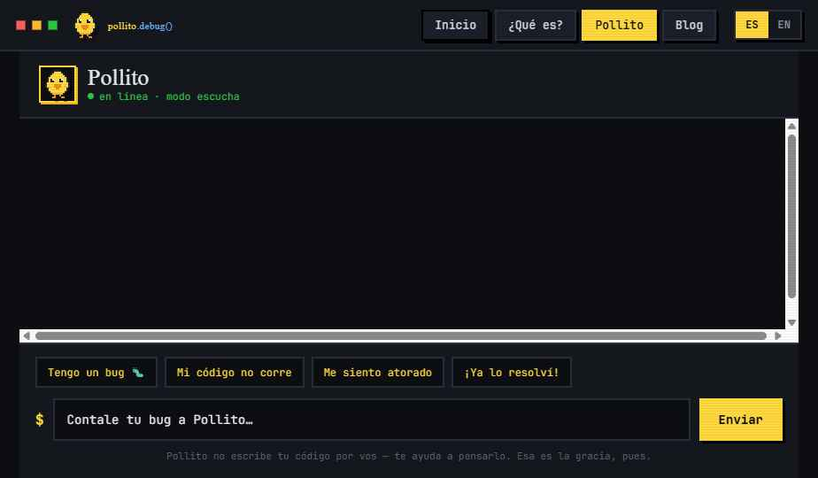
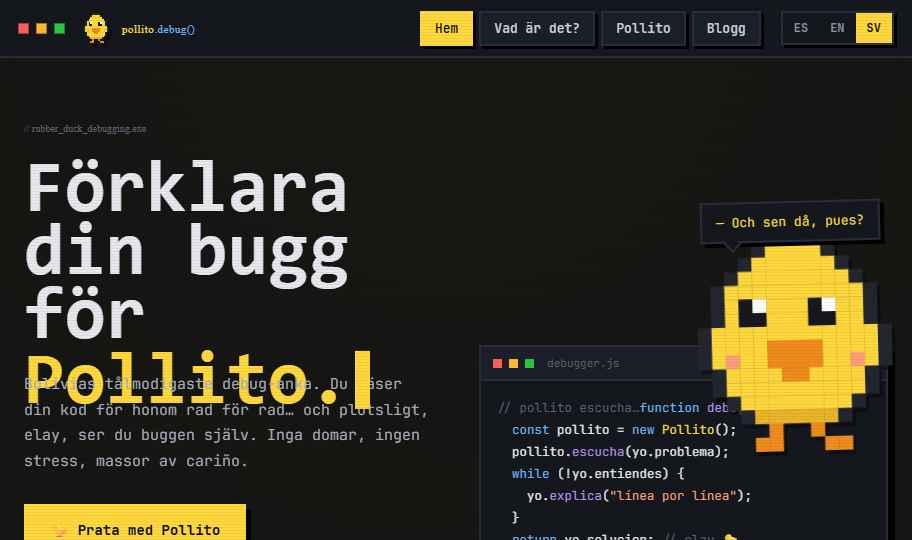

# 🐤 pollito.debug()

> Your most patient rubber duck. Walk it through your bug line by line... and suddenly you spot it yourself.



## What it is

A rubber duck debugging website with a character. **Pollito** listens while you talk through your code. It won't hand you the answer: it asks questions so you find it on your own.

The rubber duck technique is real. Explaining your problem out loud, step by step, often surfaces the bug before anyone tells you. Pollito is that duck, with a socratic streak.

## Features

- 🌍 **Trilingual** — Spanish, English and Swedish. Switch from the top bar.
- 💬 **Chat with Pollito** — classifies your message (bug, frustration, greeting, solved...) and replies from curated phrase banks per category and language.
- 📖 **Blog** — a section with articles on the technique and on debugging.
- 🎮 **Retro terminal look** — pixel art, scanlines, and the Press Start 2P, VT323 and JetBrains Mono typefaces.
- 🪶 **No build step** — a single HTML file plus its runtime. React and Babel load from unpkg at runtime.



## Running it

The runtime uses `fetch`, so the site **must be served over HTTP**. Opening the file by double-clicking (`file://`) won't work.

Locally:

```bash
# from the project folder
python -m http.server 8000
# then open http://localhost:8000
```

In production, any static host works: GitHub Pages, Netlify, Cloudflare Pages, or your own server.

## Structure

```
├── index.html        # the site (rename it from "Pollito Debug.dc.html")
├── support.js        # dc runtime: parser + React loader
└── screenshots/
    ├── chat.png
    └── sv2.png
```

## Technical notes

- The chat is **scripted**, not powered by an AI model. Replies come from category banks.
- Needs an internet connection to load React and Babel from a CDN.

## License

_To be chosen (MIT, for example)._
